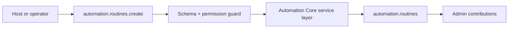

# Automation Core Developer Guide

Scheduled, API, and webhook-triggered routines with governed concurrency, catch-up policy, and operator follow-up loops.

**Maturity Tier:** `Hardened`

## Purpose And Architecture Role

Coordinates automation definitions, recurring execution, and governed follow-up behavior without hiding work inside undocumented cron glue.

### This plugin is the right fit when

- You need **automation definitions**, **scheduled execution**, **governed follow-up** as a governed domain boundary.
- You want to integrate through declared actions, resources, jobs, workflows, and UI surfaces instead of implicit side effects.
- You need the host application to keep plugin boundaries honest through manifest capabilities, permissions, and verification lanes.

### This plugin is intentionally not

- Not a generic WordPress-style hook bus or plugin macro system.
- Not a product-specific UX suite beyond the exported admin or portal surfaces that ship today.

## Repo Map

| Path | Purpose |
| --- | --- |
| `package.json` | Root extracted-repo manifest, workspace wiring, and repo-level script entrypoints. |
| `framework/builtin-plugins/automation-core` | Nested publishable plugin package. |
| `framework/builtin-plugins/automation-core/src` | Runtime source, actions, resources, services, and UI exports. |
| `framework/builtin-plugins/automation-core/tests` | Unit, contract, integration, and migration coverage where present. |
| `framework/builtin-plugins/automation-core/docs` | Internal domain-doc source set kept in sync with this guide. |
| `framework/builtin-plugins/automation-core/db/schema.ts` | Database schema contract when durable state is owned. |
| `framework/builtin-plugins/automation-core/src/postgres.ts` | SQL migration and rollback helpers when exported. |

## Manifest Contract

| Field | Value |
| --- | --- |
| Package Name | `@plugins/automation-core` |
| Manifest ID | `automation-core` |
| Display Name | Automation Core |
| Domain Group | Platform Backbone |
| Default Category | Platform Governance / Automation |
| Version | `0.1.0` |
| Kind | `plugin` |
| Trust Tier | `first-party` |
| Review Tier | `R1` |
| Isolation Profile | `same-process-trusted` |
| Framework Compatibility | ^0.1.0 |
| Runtime Compatibility | bun>=1.3.12 |
| Database Compatibility | postgres, sqlite |

## Dependency Graph And Capability Requests

| Field | Value |
| --- | --- |
| Depends On | `auth-core`, `org-tenant-core`, `role-policy-core`, `audit-core`, `jobs-core`, `issues-core`, `workflow-core`, `notifications-core`, `runtime-bridge-core` |
| Recommended Plugins | None |
| Capability Enhancing | None |
| Integration Only | None |
| Suggested Packs | None |
| Standalone Supported | Yes |
| Requested Capabilities | `ui.register.admin`, `api.rest.mount`, `data.write.automation`, `jobs.execute.ai`, `workflow.execute.ai`, `notifications.enqueue.ai` |
| Provides Capabilities | `automation.routines`, `automation.routine-runs` |
| Owns Data | `automation.routines`, `automation.routine-runs` |

### Dependency interpretation

- Direct plugin dependencies describe package-level coupling that must already be present in the host graph.
- Requested capabilities tell the host what platform services or sibling plugins this package expects to find.
- Provided capabilities and owned data tell integrators what this package is authoritative for.

## Public Integration Surfaces

| Type | ID / Symbol | Access / Mode | Notes |
| --- | --- | --- | --- |
| Action | `automation.routines.create` | Permission: `automation.routines.create` | Idempotent<br>Audited |
| Action | `automation.routines.update` | Permission: `automation.routines.update` | Idempotent<br>Audited |
| Action | `automation.routines.trigger` | Permission: `automation.routines.trigger` | Non-idempotent<br>Audited |
| Action | `automation.dead-letters.replay` | Permission: `automation.dead-letters.replay` | Non-idempotent<br>Audited |
| Resource | `automation.routines` | Portal disabled | Governed routines that run on schedules, API requests, or webhook ingress.<br>Purpose: Track automation definitions with concurrency and catch-up policy.<br>Admin auto-CRUD enabled<br>Fields: `label`, `status`, `trigger`, `operationMode`, `concurrencyPolicy`, `catchUpPolicy`, `updatedAt` |
| Resource | `automation.routine-runs` | Portal disabled | Execution history for governed routines.<br>Purpose: Show queueing, human waits, failures, escalations, and completions for operator-facing automations.<br>Admin auto-CRUD enabled<br>Fields: `routineId`, `status`, `triggerSource`, `workflowState`, `inboxQueue`, `startedAt` |
| Resource | `automation.dead-letters` | Portal disabled | Retry-exhausted or failed routine runs that require operator replay.<br>Purpose: Give automation operators an explicit dead-letter queue instead of losing failed routine context in transient logs.<br>Admin auto-CRUD enabled<br>Fields: `routineId`, `failureClass`, `status`, `inboxQueue`, `attemptCount`, `lastFailedAt` |


### UI Surface Summary

| Surface | Present | Notes |
| --- | --- | --- |
| UI Surface | Yes | A bounded UI surface export is present. |
| Admin Contributions | Yes | Additional admin workspace contributions are exported. |
| Zone/Canvas Extension | No | No dedicated zone extension export. |

## Hooks, Events, And Orchestration

This plugin should be integrated through **explicit commands/actions, resources, jobs, workflows, and the surrounding Gutu event runtime**. It must **not** be documented as a generic WordPress-style hook system unless such a hook API is explicitly exported.

- No standalone plugin-owned lifecycle event feed is exported today.
- No plugin-owned job catalog is exported today.
- No plugin-owned workflow catalog is exported today.
- Recommended composition pattern: invoke actions, read resources, then let the surrounding Gutu command/event/job runtime handle downstream automation.

## Storage, Schema, And Migration Notes

- Database compatibility: `postgres`, `sqlite`
- Schema file: `framework/builtin-plugins/automation-core/db/schema.ts`
- SQL helper file: `framework/builtin-plugins/automation-core/src/postgres.ts`
- Migration lane present: Yes

The plugin does not export a dedicated SQL helper module today. Treat the schema and resources as the durable contract instead of inventing undocumented SQL behavior.

## Failure Modes And Recovery

- Action inputs can fail schema validation or permission evaluation before any durable mutation happens.
- If downstream automation is needed, the host must add it explicitly instead of assuming this plugin emits jobs.
- There is no separate lifecycle-event feed to rely on today; do not build one implicitly from internal details.
- Schema regressions are expected to show up in the migration lane and should block shipment.

## Mermaid Flows

### Primary Lifecycle




## Integration Recipes

### 1. Host wiring

```ts
import { manifest, createRoutineAction, RoutineResource, adminContributions, uiSurface } from "@plugins/automation-core";

export const pluginSurface = {
  manifest,
  createRoutineAction,
  RoutineResource,
  
  
  adminContributions,
  uiSurface
};
```

Use this pattern when your host needs to register the plugin’s declared exports without reaching into internal file paths.

### 2. Action-first orchestration

```ts
import { manifest, createRoutineAction } from "@plugins/automation-core";

console.log("plugin", manifest.id);
console.log("action", createRoutineAction.id);
```

- Prefer action IDs as the stable integration boundary.
- Respect the declared permission, idempotency, and audit metadata instead of bypassing the service layer.
- Treat resource IDs as the read-model boundary for downstream consumers.

### 3. Cross-plugin composition

- Compose this plugin through action invocations and resource reads.
- If downstream automation becomes necessary, add it in the surrounding Gutu command/event/job runtime instead of assuming this plugin already exports a hook surface.

## Test Matrix

| Lane | Present | Evidence |
| --- | --- | --- |
| Build | Yes | `bun run build` |
| Typecheck | Yes | `bun run typecheck` |
| Lint | Yes | `bun run lint` |
| Test | Yes | `bun run test` |
| Unit | Yes | 2 file(s) |
| Contracts | Yes | 2 file(s) |
| Integration | Yes | 1 file(s) |
| Migrations | Yes | 1 file(s) |

### Verification commands

- `bun run build`
- `bun run typecheck`
- `bun run lint`
- `bun run test`
- `bun run test:contracts`
- `bun run test:integration`
- `bun run test:migrations`
- `bun run test:unit`
- `bun run docs:check`

## Current Truth And Recommended Next

### Current truth

- Exports 4 governed actions: `automation.routines.create`, `automation.routines.update`, `automation.routines.trigger`, `automation.dead-letters.replay`.
- Owns 3 resource contracts: `automation.routines`, `automation.routine-runs`, `automation.dead-letters`.
- Adds richer admin workspace contributions on top of the base UI surface.
- Defines a durable data schema contract even though no explicit SQL helper module is exported.

### Current gaps

- No standalone plugin-owned event, job, or workflow catalog is exported yet; compose it through actions, resources, and the surrounding Gutu runtime.
- The repo does not yet export a domain parity catalog with owned entities, reports, settings surfaces, and exception queues.

### Recommended next

- Add stronger operator diagnostics and replay controls where automations start owning more business-critical follow-up work.
- Clarify execution handoff patterns with jobs, workflows, and notifications as automation coverage broadens.
- Add stronger operator-facing reconciliation and observability surfaces where runtime state matters.
- Promote any currently implicit cross-plugin lifecycles into explicit command, event, or job contracts when those integrations stabilize.
- Promote important downstream reactions into explicit commands, jobs, or workflow steps instead of relying on implicit coupling.

### Later / optional

- Dedicated federation or external identity/provider adapters once the core contracts are stable.
