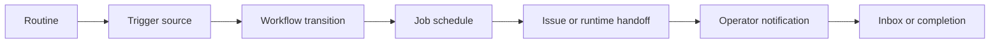

# Automation Core Developer Guide

**Maturity Tier:** `Hardened`

## Purpose And Architecture Role

`automation-core` is the platform routine layer for Gutu. It models scheduled, API, and webhook-triggered work as durable routine records with explicit concurrency, catch-up, workflow, job, and notification composition.

## Repo Map

| Path | Purpose |
| --- | --- |
| `framework/builtin-plugins/automation-core` | Publishable plugin package. |
| `framework/builtin-plugins/automation-core/src` | Actions, resources, services, policies, and admin UI exports. |
| `framework/builtin-plugins/automation-core/tests` | Unit, contract, integration, and migration coverage. |
| `framework/builtin-plugins/automation-core/db/schema.ts` | Durable schema for routines and routine runs. |
| `framework/builtin-plugins/automation-core/docs` | Internal supporting domain docs for routine handling. |

## Manifest Contract

| Field | Value |
| --- | --- |
| Package Name | `@plugins/automation-core` |
| Manifest ID | `automation-core` |
| Display Name | Automation Core |
| Kind | `plugin` |
| Trust Tier | `first-party` |
| Review Tier | `R1` |

## Dependency Graph And Capability Requests

| Field | Value |
| --- | --- |
| Depends On | `auth-core`, `org-tenant-core`, `role-policy-core`, `audit-core`, `jobs-core`, `workflow-core`, `notifications-core`, `issues-core`, `runtime-bridge-core` |
| Requested Capabilities | `ui.register.admin`, `api.rest.mount`, `data.write.automation`, `jobs.execute.ai`, `workflow.execute.ai`, `notifications.enqueue.ai` |
| Provides Capabilities | `automation.routines`, `automation.routine-runs` |
| Owns Data | `automation.routines`, `automation.routine-runs` |

## Public Integration Surfaces

| Type | ID | Notes |
| --- | --- | --- |
| Action | `automation.routines.create` | Creates a routine with trigger and policy metadata. |
| Action | `automation.routines.update` | Updates routine status, concurrency, catch-up, or schedule state. |
| Action | `automation.routines.trigger` | Fires a routine run from a schedule, API call, or webhook and can create issue/runtime context for autopilot flows. |
| Resource | `automation.routines` | Durable routine registry. |
| Resource | `automation.routine-runs` | Runtime state for triggered routine executions. |
| Workspace | `automation` | Control room and inbox views for routine operators. |

## Hooks, Events, And Orchestration

- No hook bus is exported.
- Routine execution composes `transitionWorkflowInstance`, `scheduleJobExecution`, `queueNotificationMessage`, `createIssue`, and `prepareRuntimeSession`.
- Waiting-human and escalated states surface in the automation inbox instead of disappearing into background jobs.
- Issue-drive routines can realize operator-facing issue records and runtime sessions without bypassing the governed workflow and jobs planes.

## Storage, Schema, And Migration Notes

- Schema file: `framework/builtin-plugins/automation-core/db/schema.ts`
- Durable records cover routine definitions and routine runs.
- Routine definitions now retain `operationMode`, `projectId`, `runtimeId`, `issueTitleTemplate`, and `manualTriggerEnabled`.
- Routine runs retain linked `issueId` and `runtimeSessionId` when autopilot mode is used.
- Seed data provides one daily ops handoff routine to exercise the control room and concurrency behavior.

## Failure Modes And Recovery

- Inactive routines reject trigger attempts.
- `drop` concurrency reuses the active run instead of creating duplicates.
- `replace` concurrency evicts prior active runs before writing the new one.
- Webhook and approval-reminder routines surface as waiting-human inbox items instead of reporting false completion.
- Manual triggers respect the routine-level `manualTriggerEnabled` guard instead of silently creating unapproved autopilot work.

## Mermaid Flows



## Integration Recipes

```ts
import {
  createRoutineAction,
  triggerRoutineAction,
  RoutineResource,
  RoutineRunResource
} from "@plugins/automation-core";

console.log(createRoutineAction.id);
console.log(triggerRoutineAction.id);
console.log(RoutineResource.id, RoutineRunResource.id);
```

## Test Matrix

- Root scripts: `bun run build`, `bun run typecheck`, `bun run lint`, `bun run test`, `bun run test:contracts`, `bun run test:integration`, `bun run test:migrations`, `bun run test:unit`, `bun run docs:check`
- Unit focus: routine lifecycle, concurrency policy, waiting-human handling, and manual-trigger safeguards
- Contract focus: automation workspace, inbox routes, commands
- Integration focus: end-to-end routine execution, issue-drive autopilot flows, and runtime-targeted follow-up loops

## Current Truth And Recommended Next

- Current truth: `automation-core` is the platform routine and autopilot plane, not a replacement for Codex desktop automations.
- Recommended next: add dead-letter handling, crash recovery reports, richer SLA pressure dashboards, and deeper board/runtime pivots.
